# Der Infoscreen Designer in Bildern

Was der Designer kann, auf einen Blick – für Gemeinden, die überlegen, ob er zu ihnen passt, und für alle, die ihn
neu kennenlernen. Wie man ihn einrichtet, steht in der [Einrichtungsanleitung](Einrichtung.md), wie man damit
arbeitet, im [Onboarding](Onboarding.md).

**Alle Bilder zeigen eine erfundene „Gemeinde am Markt"** mit ausgedachten Terminen, Gruppen, Namen und Bildern –
nichts davon stammt aus einer echten ChurchTools-Instanz. Die Bilder entstehen automatisch
(`npm run docs:screenshots`) und lassen sich nach jeder Änderung neu erzeugen.

## Die Screens

Jeder Fernseher ist eine Kachel – mit dem, was er **gerade** zeigt. Ein Klick öffnet die laufende Playlist im
Editor; Adresse, Zeitplan und Player stecken im Menü „…", für Administratoren dazu „Umbenennen" und „Einstellungen". Filter trennen Quer- und Hochformat. Die Angaben der
Kachel stehen untereinander, zuletzt wann und von wem sie oder ihr Zeitplan zuletzt geändert wurde. Alle Bereiche –
Screens, Playlists, Zeitpläne, Hinweise und Mediathek – zeigen dieselben Kacheln in derselben Breite; lange Namen
brechen um, nichts wird abgeschnitten.

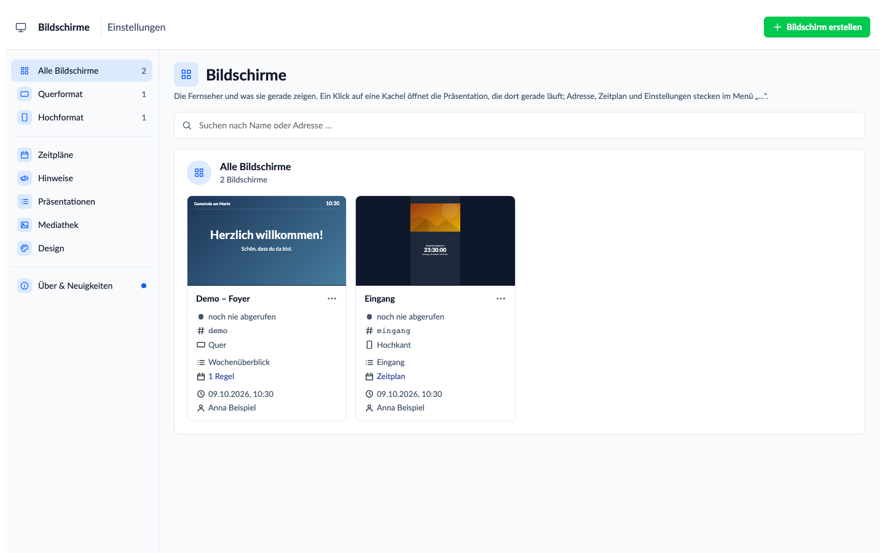

## Der Editor

Slides gestalten wie in einem Folienprogramm: links die Slides, oben „+ Baustein" (alle Bausteine, alphabetisch), in der
Mitte die Bildfläche, rechts der Inspektor: oben der Inhalt des gewählten Bausteins, darunter aufklappbare Bereiche.
Ziehen, an den Griffen skalieren, am Raster ausrichten, sperren, rückgängig machen. Termine kommen live aus den
Kalendern von ChurchTools – hier als Karten mit Datumskachel und Kalenderfarbe. **Zur Wahl stehen nur öffentliche
Kalender** – solche, die man in ChurchTools auch ohne Anmeldung sieht; ein „Rechte aktualisieren" braucht es dafür nicht.
Interne Termine (nur für angemeldete Benutzer) zeigt kein Fernseher. Hat ein Baustein einen Kalender, der nicht
öffentlich ist, nennt ihn der Editor und bietet an, ihn zu entfernen; fehlt einer, sagt der Editor, wie man ihn in
ChurchTools freigibt.

**Farben aus der Palette:** An jedem Farbfeld des Editors stehen kleine Tupfer in zwei Gruppen. Zuerst die
**„Farbpalette"** – Akzent, Text und Hintergrund des Designs, dann die Palette (Seite „Design"); das ist das
Freigegebene. Darunter **„Auf der Slide"** – alle Farben, die die gerade bearbeitete Slide benutzt; eine freigegebene
trägt dort ihren Namen aus der Palette, eine abweichende nur ihren Hex-Wert. Eine leere Gruppe erscheint nicht; Farbwähler und
Hex-Feld bleiben, abweichen geht weiter. Ein Klick setzt den Hex-Wert, beim Darüberfahren steht der Name.
Die Farbe wird **kopiert**: Ändert ihr eine Palettenfarbe später, färbt das bestehende Slides nicht um.

**Schrift:** Im Bereich „Schrift" – in jedem Baustein, der Schrift hat – steht neben Schriftart, Größe, Stärke und
Farbe das Kästchen **„Großbuchstaben"**. Ihr schreibt wie gewohnt; der Fernseher zeigt den Text in Großbuchstaben, der
gespeicherte Text bleibt, wie ihr ihn getippt habt.
Neben **„Ausrichtung"** (links, mittig, rechts) steht **„Vertikal"** – oben, mittig oder unten in der Box: bei Text,
Uhr, Countdown, Nächstem Termin und Gemeindekopf. Ohne Wahl bleibt es, wie der Baustein es bisher tat. Passt der Inhalt
nicht in die Box, beginnt er oben; der Anfang wird nie abgeschnitten. Listen füllen ihre Box Seite für Seite und haben
das Feld nicht.

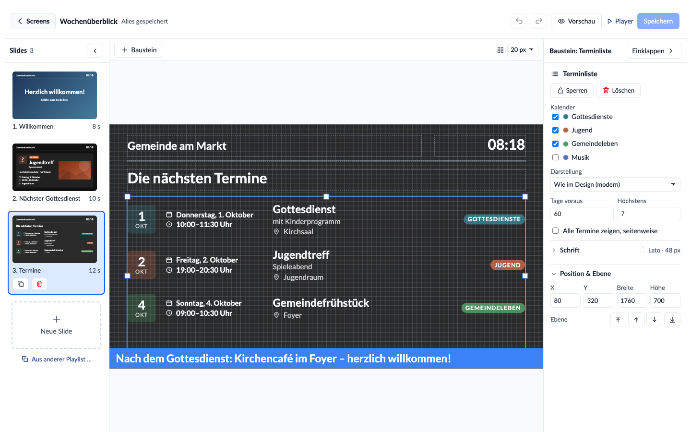

**Fünfzehn Bausteine:** Text, Bild, Fläche, Galerie, Video, Uhr, Terminliste, Nächster Termin, Gemeindekopf mit Logo,
Webseite, QR-Code, Countdown, Beiträge, Gruppen und Raumbelegung. Beim Baustein „Webseite" geht statt der Adresse auch der
Einbettungscode (`<iframe …>`), den Karten, Umfragen oder Pinnwände anbieten – übernommen wird nur die Adresse darin.
Seiten des eigenen ChurchTools bettet der Baustein nicht ein.

## Galerie

Bilder aus der Mediathek nacheinander, mit vier Übergängen (Überblenden, Schieben, Aufdecken oder harter Schnitt). Dazu zoomt jedes Bild auf Wunsch langsam hinein, heraus oder abwechselnd (Feld „Bewegung"). Mehrere Bilder auf einmal wählen, mit ↑/↓
sortieren, Dauer je Bild und Darstellung (Ganz zeigen oder Fläche füllen) einstellen. Die Slide läuft, bis jedes Bild
einmal zu sehen war; höchstens 30 Bilder. Die Bilder liegen auf dem Gerät, die Galerie läuft auch ohne Netz.

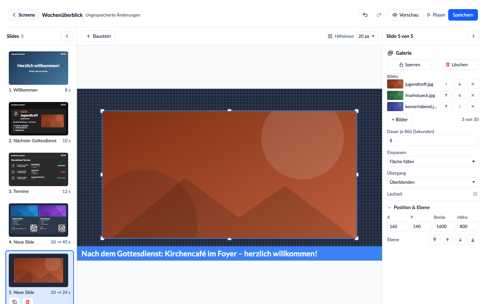

## Video

Ein Video aus der Mediathek, als Endlosschleife und von vorn bei jedem Durchlauf der Slide. Hochgeladen wird **MP4 mit
H.264, bis 128 MB**; das Video bleibt, wie es ist – es wird nicht umgerechnet. Der **Ton** lässt sich je Baustein
einschalten (Vorgabe: aus); er startet nur, wenn der Browser des Fernsehers es erlaubt, sonst läuft das Video stumm.
Die Slide dauert mindestens so lange wie das Video. **Ohne Netz zeigt der Fernseher an dieser Stelle nichts:** Videos
werden nicht auf dem Gerät gespeichert, sondern bei jedem Durchlauf von ChurchTools geladen. Dafür braucht das Gerät
das Recht „Wiki-Bereich „Infoscreen" sehen" – der Assistent vergibt es. In der Vorschau laufen Videos stumm; ein Knopf
am Video schaltet den Ton zu. Auf einem Kiosk-Gerät noch nicht im Dauerbetrieb geprüft.

## Gruppen aus ChurchTools

Was es in der Gemeinde für Gruppen gibt – direkt aus einer **Gruppen-Homepage** von ChurchTools, ohne doppelte
Pflege. Je Gruppe Name, Bild, Wochentag und Uhrzeit, Zielgruppe, Kategorie, Beschreibung, freie Plätze, auf Wunsch
die Leitung mit Bild und ein **QR-Code auf die öffentliche Gruppenseite** zum Anmelden. Jede Angabe lässt sich
einzeln abschalten; ein bis vier Gruppen je Seite, oder als Liste. Die Gruppen stehen nach Wochentag (Montag zuerst)
oder nach Name, auf- oder absteigend – oder in einer eigenen Auswahl und Reihenfolge.

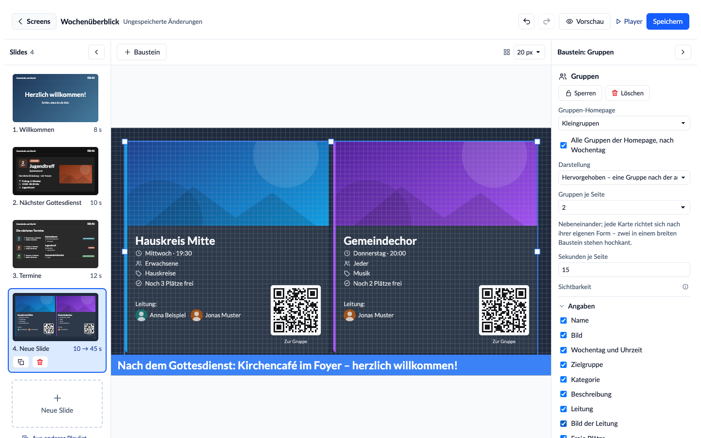

Gezeigt wird nur, was ChurchTools auf der Gruppen-Homepage ohnehin öffentlich zeigt.

## Raumbelegung

„Was ist heute im Saal los?" – die Buchungen der **Räume** aus ChurchTools, als **Übersicht** aller gewählten Räume oder
als **Türschild** des ersten Raums: „Jetzt" mit Titel und Ende oder „Frei" (mit „bis 14:00", wenn noch etwas kommt),
darunter „Danach" mit den nächsten Buchungen. Die laufende Buchung ist hervorgehoben; heute oder heute und morgen;
ein **Wegweiser** je Raum („1. OG, links"). Gewählt werden nur Räume, nicht Gegenstände und Fahrzeuge. Die Übersicht
wechselt seitenweise, die Slide bleibt, bis alle Seiten gelaufen sind.

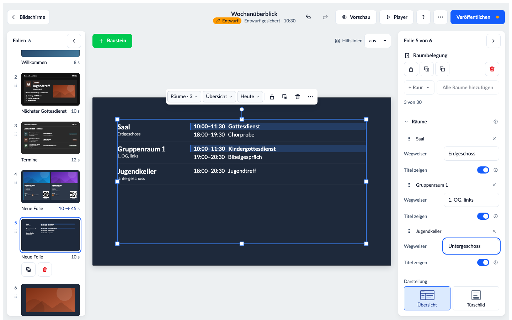

Nur bestätigte Buchungen erscheinen, und nur Raum, Zeit und Titel – nie Beschreibung, Notizen oder Namen der Buchenden.
Weil ein Titel Namen enthalten kann („Gespräch Familie X"), lässt er sich **je Raum abschalten**; dann steht dort
„Belegt". Die Rechte dafür vergibt der Assistent (siehe [Rechte](Rechte.md)).

## Der Raum am Termin

Beim **Nächsten Termin** und bei der **Terminliste als Karten** zeigt der Schalter **„Raum zeigen"** die gebuchten Räume
neben dem Ort, mit der Pin-Nadel: „Gemeindezentrum · Saal". Nur bestätigte Buchungen von Räumen zählen, und am Termin
steht nur der Raumname, nie ein Buchungstitel. Das Gerät braucht dafür das Recht, alle Räume zu sehen – „Rechte
aktualisieren" gibt es ihm (siehe [Rechte](Rechte.md)). Hat ein Baustein mehrere Kalender, lässt sich
„Räume zeigen für:" je Kalender abschalten – etwa wo für einen Termin viele Räume gebucht werden; ein eingetragener Ort
bleibt stehen.

## Die Dienste am Termin

Beim **Nächsten Termin** und bei der **Terminliste als Karten** zeigt „Dienste zeigen", wer einen Dienst übernimmt –
„Predigt: Anna Beispiel · Moderation: Ben Muster" –, in einer eigenen Zeile mit einem Personen-Symbol (in der Liste unter Titel und Untertitel).
Gewählt wird je Baustein aus den Diensten, die ein Administrator unter **Einstellungen → Dienste auf Screens** freigegeben hat;
ohne Freigabe erscheint kein Dienst. Gezeigt werden nur **zugesagte** Einteilungen und nur
Dienste aus Dienstgruppen, die in ChurchTools „Ohne Berechtigung einsehbar" sind; was eine Gemeinde dort verborgen hält,
bleibt auch am Fernseher verborgen, und am Termin stehen nur Name und Dienst, nie ein Foto oder ein Kommentar. Das Gerät
braucht dafür das Recht, die Events der Kalender zu sehen – „Rechte aktualisieren" gibt es ihm (siehe [Rechte](Rechte.md)).

## Die Vorschau – genau wie am Fernseher

„Vorschau" spielt die Playlist mit allen ungespeicherten Änderungen im Vollbild ab: dieselben Bausteine, derselbe
Wechsel, dieselben Daten wie am Fernseher. Die Gruppen wechseln seitenweise; die Slide bleibt, bis alle Seiten
gelaufen sind.

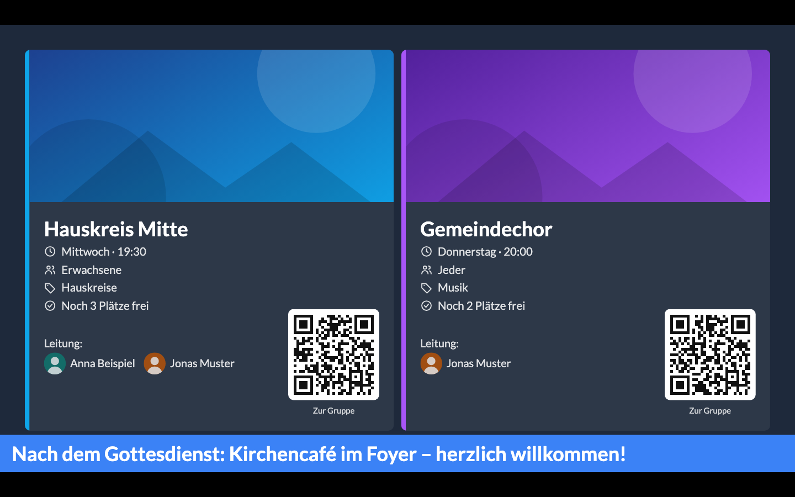

## Beiträge aus ChurchTools

Die neuesten Beiträge öffentlicher Gruppen – mit Bild, Gruppe und Alter des Beitrags, einer nach dem anderen oder als
Liste. Abgelaufene Beiträge erscheinen nie; den Namen der Autorin oder des Autors zeigt der Baustein nur, wenn man es
einschaltet.

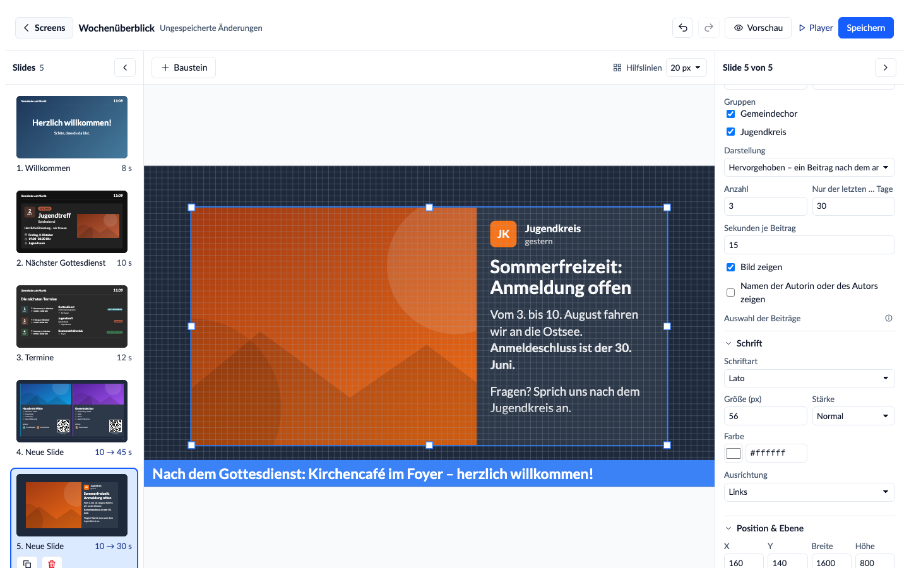

## Hinweise

Ein Band über allen Slides – als Laufschrift oder stehend, etwa „Heute Parkplatz gesperrt". Es läuft auf den
gewählten Playlists und verschwindet zur eingestellten Zeit von selbst. Jeder Hinweis ist eine Kachel mit einer
**Zeitleiste über die nächsten sieben Tage**: Sie zeigt, wann er tatsächlich am Fernseher steht – also wann eine
seiner Playlists laut Zeitplan auf einem Screen läuft, bis zu seinem Ende. Darunter steht jeder Screen in einer
eigenen Zeile; fährt man darüber, leuchten seine Zeiten auf. Steht ein Hinweis in den sieben Tagen auf keinem
Fernseher, sagt die Kachel das. Jeder Hinweis zeigt auch, wann und von wem er zuletzt geändert wurde; das Speichern
einer Slide zählt dabei nicht.

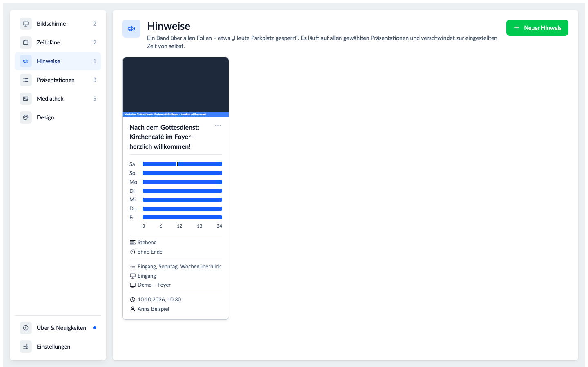

## Playlists

Eine Playlist ist der Inhalt eines Screens und kann auf mehreren Screens laufen. Duplizieren ergibt eine Kopie mit
eigenen Slides – oder auf Wunsch eine Playlist mit denselben, verknüpften Slides. Jede Kachel zeigt, wann die
Playlist oder eine ihrer Slides zuletzt geändert wurde und von wem.

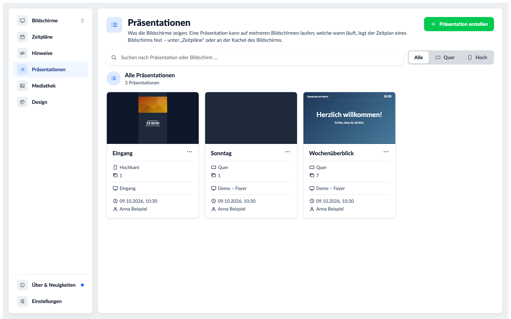

## Zeitpläne

Welche Playlist ein Screen wann zeigt: nach Uhrzeit („sonntags 9–12 Uhr") oder rund um Termine („30 Minuten vor
Beginn bis 10 Minuten nach Beginn"). Jeder Screen ist eine Kachel mit der Playlist, die gerade läuft, und einer
**Zeitleiste über die nächsten sieben Tage** – heute oben, mit einer Nadel für jetzt, jede Playlist in ihrer Farbe
wie im Zeitplan-Dialog. Darunter die Regeln in denselben Farben: Fährt man über eine Regel, leuchten ihre Zeiten
auf; ein Klick auf eine Regel oder einen Abschnitt zeigt deren Playlist im Bild. Zuletzt steht, wann und von wem
der Zeitplan oder der Screen zuletzt gespeichert wurde.

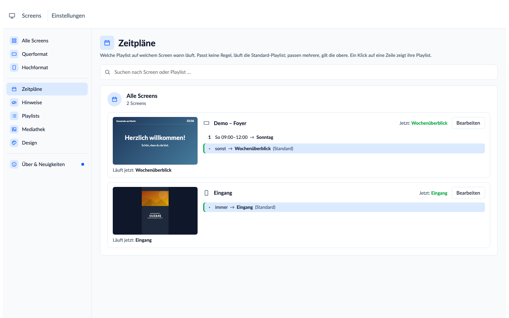

## Mediathek

Bilder und Videos einmal hochladen und überall verwenden. Unter jedem Bild steht, wo es läuft; „Unbenutzt" hilft beim
Aufräumen. Darunter steht, wann und von wem die Datei hochgeladen wurde – so, wie ChurchTools es an der Datei führt. Videos zeigen ein Standbild mit ihrer Länge. Ein Klick auf eine Kachel öffnet die Datei groß – so, wie ein Fernseher sie zeigt –
mit Maßen, Länge und Datum, auf dunklem, hellem oder kariertem Grund; mit den Pfeiltasten blättert man durch die gerade sichtbaren
Dateien. Im Auswahl-Dialog des Editors öffnet das Auge auf der Kachel die Vorschau, dort steht auch „Verwenden".

Zum Aufräumen wählt man eine oder mehrere Dateien über das Kästchen auf der Kachel und löscht sie gemeinsam. Vorher
nennt ein Dialog jede Datei – und zu jeder, die noch auf einer Slide läuft, die Stelle. Verwendete Dateien lassen sich
dabei aussparen („Nur unbenutzte löschen").

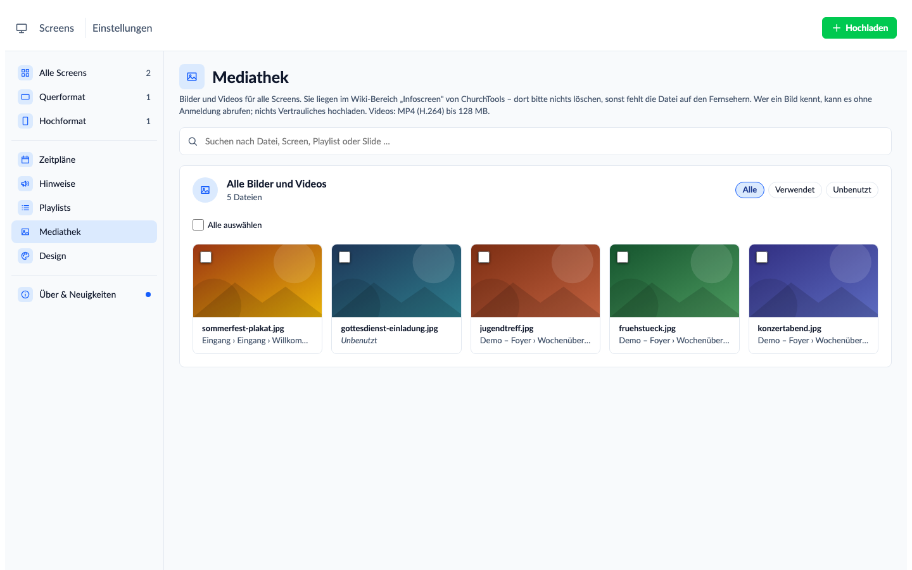

## Design

Einmal für alle Screens: Ecken, Akzentfarbe, Farben und Schrift für neue Bausteine, Termine schlicht oder als Karten,
das Format der Bilder – mit Vorschau. Dazu eine **Farbpalette**: bis zu zwölf Farben der Gemeinde mit Namen
(„Gemeindeblau"), in einer Reihenfolge, die ihr selbst bestimmt.

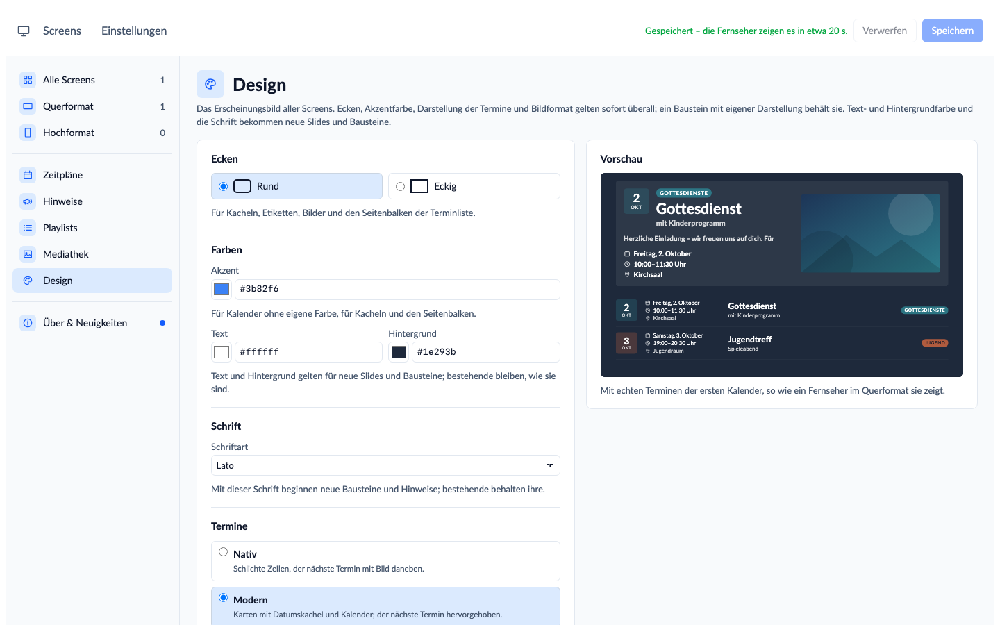

## Am Handy und auf dem Tablet

Der Designer passt sich dem Telefon an: Seiten über ein Menü, Slides und Bausteine zum Aufklappen, die Einstellungen
eines Bausteins als Blatt am unteren Rand – die ganze Slide bleibt darüber im Blick. Auf dem Tablet nimmt die Slide
fast die ganze Breite ein; die Einstellungen öffnen hochkant als Blatt, quer als Spalte daneben. Am Rechner lassen
sich Slides und Einstellungen einklappen.

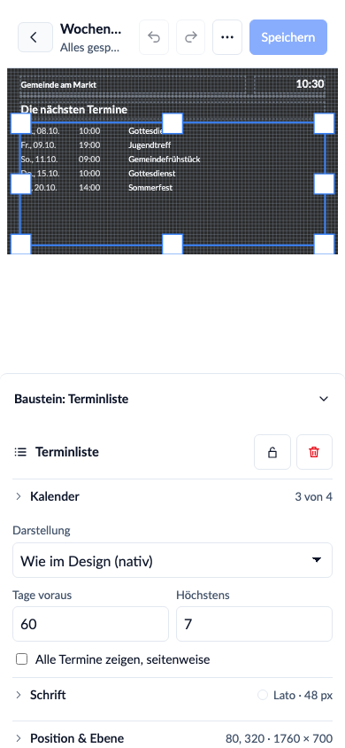

## Am Fernseher

Ohne Bild, weil es dort nichts zu bedienen gibt: Der Fernseher meldet sich über seine Adresse selbst an, holt
Änderungen in etwa 20 Sekunden, hält Daten und Bilder auf dem Gerät, zeigt bei einem Netzausfall den letzten Stand
und lädt jede Nacht neu. Er braucht weder Tastatur noch Maus.
