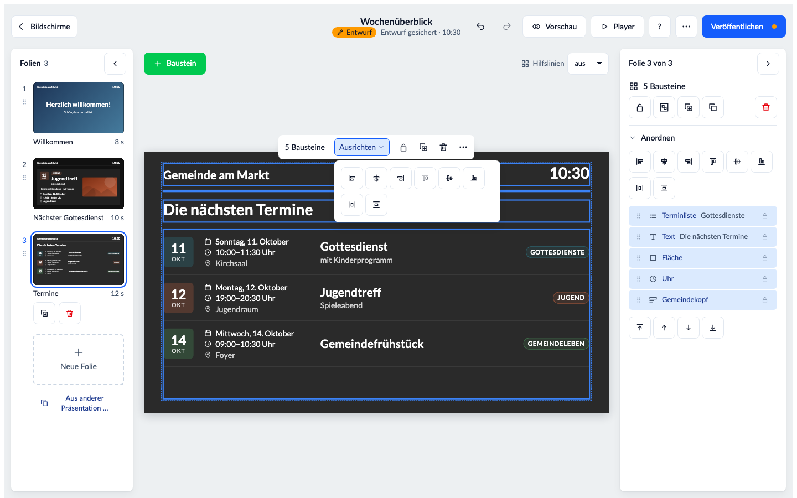

# Der Infoscreen Designer in Bildern

Was der Designer kann, auf einen Blick – für Gemeinden, die überlegen, ob er zu ihnen passt, und für alle, die ihn
neu kennenlernen. Wie man ihn einrichtet, steht in der [Einrichtungsanleitung](Einrichtung.md), wie man damit
arbeitet, im [Onboarding](Onboarding.md).

**Alle Bilder zeigen eine erfundene „Gemeinde am Markt"** mit ausgedachten Terminen, Gruppen, Namen und Bildern –
nichts davon stammt aus einer echten ChurchTools-Instanz. Die Bilder entstehen automatisch
(`npm run docs:screenshots`) und lassen sich nach jeder Änderung neu erzeugen.

## Die Bildschirme

Jeder Fernseher ist eine Kachel – mit dem, was er **gerade** zeigt. Ein Klick öffnet die laufende Präsentation im
Editor; Adresse, Zeitplan und Player stecken im Menü „…", für Administratoren dazu „Umbenennen" und „Einstellungen". Filter trennen Quer- und Hochformat. Die Angaben der
Kachel stehen untereinander: zuerst, ob der Fernseher **„online"** ist – er meldet sich alle fünf Minuten –, sonst
**„nicht online seit …"** oder **„noch nie abgerufen"**; zuletzt wann und von wem sie oder ihr Zeitplan zuletzt geändert
wurde. Alle Bereiche –
Bildschirme, Präsentationen, Zeitpläne, Hinweise und Mediathek – zeigen dieselben Kacheln in derselben Breite; lange Namen
brechen um, nichts wird abgeschnitten.

## Der Editor

Folien gestalten wie in einem Folienprogramm: links die Folien, oben „+ Baustein", in der
Mitte die Bildfläche, rechts der Inspektor: oben der Inhalt des gewählten Bausteins, darunter aufklappbare Bereiche.
„+ Baustein" nennt zu jedem Baustein in einem Satz, was er zeigt, und hat ein Suchfeld („kalender" findet die
Terminliste). Ziehen, an den Griffen skalieren, am Raster ausrichten, sperren, rückgängig machen. **Beim Ziehen zeigt die Bildfläche die Abstände** zu den Nachbarn und zum Rand in Orange, dazu die Größe; kommt ein Abstand einem schon vorhandenen nahe, rastet er ein, und beide gleichen Abstände sind markiert. Mit gedrückter Alt-Taste über einem anderen Baustein stehen die Abstände zwischen beiden. **Kopieren, Einfügen, Duplizieren** gehen mit Strg/⌘ + C, V, D oder den Knöpfen im Inspektor und neben „+ Baustein" – eingefügt wird an derselben Stelle, auch auf einer anderen Folie. Alle Tastengriffe zeigt „?" oben im Editor.

**Das Kurzmenü:** Über dem gewählten Baustein steht ein kleines Menü mit dem, was man an ihm am häufigsten
ändert – beim Text Textstufe, Farbe und Ausrichtung, beim Bild „Bild tauschen", bei Terminen die Kalender („Kalender ·
3"). Rechts daneben Sperren, Duplizieren, Löschen und „⋯" mit Kopieren, Einfügen, den Ebenen und **„Alle
Einstellungen"**, das den Inspektor öffnet. Beim Ziehen tritt es beiseite. **Ein Doppelklick führt zum Inhalt:** Auf
einem Text schreibt man direkt auf der Folie, in derselben Schrift und Größe, die der Fernseher zeigt; auf einem Bild
öffnet er die Mediathek, auf einer Terminliste die Kalender. Ein Baustein, dem noch etwas fehlt, trägt mittig einen
Knopf wie „Bild wählen" oder „Adresse eingeben". Text gibt es in drei **Textstufen** – Überschrift, Untertitel, Text –,
für quer und hochkant gleich groß.

Termine kommen live aus den Kalendern von ChurchTools – hier als Karten mit Datumskachel und Kalenderfarbe. **Zur Wahl stehen nur öffentliche
Kalender** – solche, die man in ChurchTools auch ohne Anmeldung sieht; ein „Rechte aktualisieren" braucht es dafür nicht.
Interne Termine (nur für angemeldete Benutzer) zeigt kein Fernseher. Hat ein Baustein einen Kalender, der nicht
öffentlich ist, nennt ihn der Editor und bietet an, ihn zu entfernen; fehlt einer, sagt der Editor, wie man ihn in
ChurchTools freigibt.

**Farben aus der Palette:** An jedem Farbfeld des Editors stehen kleine Tupfer in zwei Gruppen. Zuerst die
**„Farbpalette"** – Akzent, Text und Hintergrund des Designs, dann die Palette (Seite „Design"); das ist das
Freigegebene. Darunter **„Auf der Folie"** – alle Farben, die die gerade bearbeitete Folie benutzt; eine freigegebene
trägt dort ihren Namen aus der Palette, eine abweichende nur ihren Hex-Wert. Eine leere Gruppe erscheint nicht; Farbwähler und
Hex-Feld bleiben, abweichen geht weiter. Ein Klick setzt den Hex-Wert, beim Darüberfahren steht der Name.
Die Farbe wird **kopiert**: Ändert ihr eine Palettenfarbe später, färbt die bestehenden Folien nicht um.

**Schrift:** Im Bereich „Schrift" – in jedem Baustein, der Schrift hat – steht neben Schriftart, Größe, Stärke und
Farbe das Kästchen **„Großbuchstaben"**. Ihr schreibt wie gewohnt; der Fernseher zeigt den Text in Großbuchstaben, der
gespeicherte Text bleibt, wie ihr ihn getippt habt.
Neben **„Ausrichtung"** (links, mittig, rechts) steht **„Vertikal"** – oben, mittig oder unten in der Box: bei Text,
Uhr, Countdown, Nächstem Termin und Gemeindekopf. Ohne Wahl bleibt es, wie der Baustein es bisher tat. Passt der Inhalt
nicht in die Box, beginnt er oben; der Anfang wird nie abgeschnitten. Listen füllen ihre Box Seite für Seite und haben
das Feld nicht.

**Fünfzehn Bausteine:** Text, Bild, Fläche, Galerie, Video, Uhr, Terminliste, Nächster Termin, Gemeindekopf mit Logo,
Webseite, QR-Code, Countdown, Beiträge, Gruppen und Raumbelegung. Beim Baustein „Webseite" geht statt der Adresse auch der
Einbettungscode (`<iframe …>`), den Karten, Umfragen oder Pinnwände anbieten – übernommen wird nur die Adresse darin.
Seiten des eigenen ChurchTools bettet der Baustein nicht ein.

## Entwurf und Veröffentlichen

Ausprobieren ist gefahrlos: Der Editor **sichert jede Änderung von selbst als Entwurf** („Entwurf gesichert · 14:32"),
die Fernseher zeigen weiter den veröffentlichten Stand. Erst **„Veröffentlichen"** bringt die Änderungen auf die
Fernseher, nach etwa 20 Sekunden. Solange etwas noch nicht veröffentlicht ist, trägt die Präsentation die warme Marke
**„Entwurf"** – im Editor unter dem Titel und auf ihrer Kachel unter „Präsentationen", dort mit „von wem, wann".
Der Entwurf gehört der Präsentation, nicht der Person: Wer sie danach öffnet – am Rechner oder am Handy –, arbeitet am
selben Entwurf weiter; sichern zwei gleichzeitig, fragt der Editor, wessen Stand gelten soll. **„Entwurf verwerfen"**
im Menü „⋯" kehrt zum veröffentlichten Stand zurück. Läuft die Präsentation gerade, steht das im Editor; verknüpfte
Folien nennt ein Dialog vor dem Veröffentlichen. Entwürfe liegen in einer eigenen Ablage, die kein Fernseher lesen
darf – ein Gerät kann einen Entwurf nie zeigen (siehe [Rechte](Rechte.md)). Solange ein Administrator nach dem Update
noch nicht „Rechte aktualisieren" geklickt hat, geht jede Änderung mit „Veröffentlichen" wie früher direkt auf die
Fernseher; der Editor sagt das.

## Mehrere Bausteine

Mit Umschalt-Klick, einem **Auswahlrahmen** auf der leeren Fläche oder Strg/⌘ + A wählt man mehrere Bausteine
und zieht, kopiert, dupliziert oder löscht sie gemeinsam; eingefügt wird die ganze Gruppe in ihrer Lage zueinander.
**Ausrichten und Verteilen:** links, mittig, rechts, oben, mittig, unten, und ab drei Bausteinen gleiche Abstände –
im Kurzmenü unter „Ausrichten" und im Inspektor unter „Anordnen". Ein gesperrter Baustein bleibt stehen, die anderen
richten sich nach ihm. **Gruppieren** (Strg/⌘ + G) hält zusammen, was zusammengehört – Titel mit Uhrzeit, Bild mit
Bildunterschrift: Ein Klick wählt dann die ganze Gruppe, ein Doppelklick ein einzelnes Mitglied. Solange nichts
gewählt ist, zeigt der Inspektor **„Bausteine dieser Folie"**, oben = vorne: Ein Klick wählt, das Schloss sperrt,
Ziehen ändert die Ebene – so erreicht man auch, was ganz verdeckt liegt.

## Galerie

Bilder aus der Mediathek nacheinander, mit vier Übergängen (Überblenden, Schieben, Aufdecken oder harter Schnitt). Dazu zoomt jedes Bild auf Wunsch langsam hinein, heraus oder abwechselnd (Feld „Bewegung"). Mehrere Bilder auf einmal wählen, mit ↑/↓
sortieren, Dauer je Bild und Darstellung (Ganz zeigen oder Fläche füllen) einstellen. Die Folie läuft, bis jedes Bild
einmal zu sehen war; höchstens 30 Bilder. Die Bilder liegen auf dem Gerät, die Galerie läuft auch ohne Netz.

## Video

Ein Video aus der Mediathek, als Endlosschleife und von vorn bei jedem Durchlauf der Folie. Hochgeladen wird **MP4 mit
H.264, bis 128 MB**; das Video bleibt, wie es ist – es wird nicht umgerechnet. Der **Ton** lässt sich je Baustein
einschalten (Vorgabe: aus); er startet nur, wenn der Browser des Fernsehers es erlaubt, sonst läuft das Video stumm.
Die Folie dauert mindestens so lange wie das Video. **Ohne Netz zeigt der Fernseher an dieser Stelle nichts:** Videos
werden nicht auf dem Gerät gespeichert, sondern bei jedem Durchlauf von ChurchTools geladen. Dafür braucht das Gerät
das Recht „Wiki-Bereich „Infoscreen" sehen" – der Assistent vergibt es. In der Vorschau laufen Videos stumm; ein Knopf
am Video schaltet den Ton zu. Auf einem Kiosk-Gerät noch nicht im Dauerbetrieb geprüft.

## Gruppen aus ChurchTools

Was es in der Gemeinde für Gruppen gibt – direkt aus einer **Gruppen-Homepage** von ChurchTools, ohne doppelte
Pflege. Je Gruppe Name, Bild, Wochentag und Uhrzeit, Zielgruppe, Kategorie, Beschreibung, freie Plätze, auf Wunsch
die Leitung mit Bild und ein **QR-Code auf die öffentliche Gruppenseite** zum Anmelden. Jede Angabe lässt sich
einzeln abschalten; ein bis vier Gruppen je Seite, oder als Liste. Die Gruppen stehen nach Wochentag (Montag zuerst)
oder nach Name, auf- oder absteigend – oder in einer eigenen Auswahl und Reihenfolge.

Gezeigt wird nur, was ChurchTools auf der Gruppen-Homepage ohnehin öffentlich zeigt.

## Raumbelegung

„Was ist heute im Saal los?" – die Buchungen der **Räume** aus ChurchTools, als **Übersicht** aller gewählten Räume oder
als **Türschild** des ersten Raums: „Jetzt" mit Titel und Ende oder „Frei" (mit „bis 14:00", wenn noch etwas kommt),
darunter „Danach" mit den nächsten Buchungen. Die laufende Buchung ist hervorgehoben; heute oder heute und morgen;
ein **Wegweiser** je Raum („1. OG, links"). Gewählt werden nur Räume, nicht Gegenstände und Fahrzeuge. Die Übersicht
wechselt seitenweise, die Folie bleibt, bis alle Seiten gelaufen sind.

Nur bestätigte Buchungen erscheinen, und nur Raum, Zeit und Titel – nie Beschreibung, Notizen oder Namen der Buchenden.
Weil ein Titel Namen enthalten kann („Gespräch Familie X"), lässt er sich **je Raum abschalten**; dann steht dort
„Belegt". Die Rechte dafür vergibt der Assistent (siehe [Rechte](Rechte.md)).

## Der Raum am Termin

Beim **Nächsten Termin** und bei der **Terminliste als Karten** zeigt der Schalter **„Raum zeigen"** die gebuchten Räume,
mit der Pin-Nadel: „Saal, Raum 01". Ist am Termin ein Ort eingetragen, steht nur dieser – wie im WordPress-Plugin, damit
nichts doppelt steht; die Räume springen ein, wo kein Ort gepflegt ist. Nur bestätigte Buchungen von Räumen zählen, und am Termin
steht nur der Raumname, nie ein Buchungstitel. Das Gerät braucht dafür das Recht, alle Räume zu sehen – „Rechte
aktualisieren" gibt es ihm (siehe [Rechte](Rechte.md)). Hat ein Baustein mehrere Kalender, lässt sich
„Räume zeigen für:" je Kalender abschalten – etwa wo für einen Termin viele Räume gebucht werden.

## Die Dienste am Termin

Beim **Nächsten Termin** und bei der **Terminliste als Karten** zeigt „Dienste zeigen", wer einen Dienst übernimmt –
„Predigt: Anna Beispiel · Moderation: Ben Muster" –, in einer eigenen Zeile mit einem Personen-Symbol (in der Liste unter Titel und Untertitel).
Gewählt wird je Baustein aus den Diensten, die ein Administrator unter **Einstellungen → Dienste auf Bildschirmen** freigegeben hat;
ohne Freigabe erscheint kein Dienst. Gezeigt werden nur **zugesagte** Einteilungen und nur
Dienste aus Dienstgruppen, die in ChurchTools „Ohne Berechtigung einsehbar" sind; was eine Gemeinde dort verborgen hält,
bleibt auch am Fernseher verborgen, und am Termin stehen nur Name und Dienst, nie ein Foto oder ein Kommentar. Das Gerät
braucht dafür das Recht, die Events der Kalender zu sehen – „Rechte aktualisieren" gibt es ihm (siehe [Rechte](Rechte.md)).

## Die Vorschau – genau wie am Fernseher

„Vorschau" spielt die Präsentation mit allen noch nicht veröffentlichten Änderungen im Vollbild ab: dieselben Bausteine, derselbe
Wechsel, dieselben Daten wie am Fernseher. Die Gruppen wechseln seitenweise; die Folie bleibt, bis alle Seiten
gelaufen sind.

## Beiträge aus ChurchTools

Die neuesten Beiträge öffentlicher Gruppen – mit Bild, Gruppe und Alter des Beitrags, einer nach dem anderen oder als
Liste. Abgelaufene Beiträge erscheinen nie; den Namen der Autorin oder des Autors zeigt der Baustein nur, wenn man es
einschaltet.

## Hinweise

Ein Band über allen Folien – als Laufschrift oder stehend, etwa „Heute Parkplatz gesperrt". Es läuft auf den
gewählten Präsentationen und verschwindet zur eingestellten Zeit von selbst. Jeder Hinweis ist eine Kachel mit einer
**Zeitleiste über die nächsten sieben Tage**: Sie zeigt, wann er tatsächlich am Fernseher steht – also wann eine
seiner Präsentationen laut Zeitplan auf einem Bildschirm läuft, bis zu seinem Ende. Darunter steht jeder Bildschirm in einer
eigenen Zeile; fährt man darüber, leuchten seine Zeiten auf. Steht ein Hinweis in den sieben Tagen auf keinem
Fernseher, sagt die Kachel das. Jeder Hinweis zeigt auch, wann und von wem er zuletzt geändert wurde; das Veröffentlichen
einer Folie zählt dabei nicht.

## Präsentationen

Eine Präsentation ist der Inhalt eines Bildschirms und kann auf mehreren Bildschirmen laufen. Duplizieren ergibt eine Kopie mit
eigenen Folien – oder auf Wunsch eine Präsentation mit denselben, verknüpften Folien. Jede Kachel zeigt, wann die
Präsentation oder eine ihrer Folien zuletzt geändert wurde und von wem; liegt ein Entwurf vor, trägt sie die Marke
„Entwurf".

## Zeitpläne

Welche Präsentation ein Bildschirm wann zeigt: nach Uhrzeit („sonntags 9–12 Uhr") oder rund um Termine („30 Minuten vor
Beginn bis 10 Minuten nach Beginn"). Jeder Bildschirm ist eine Kachel mit der Präsentation, die gerade läuft, und einer
**Zeitleiste über die nächsten sieben Tage** – heute oben, mit einer Nadel für jetzt, jede Präsentation in ihrer Farbe
wie im Zeitplan-Dialog. Darunter die Regeln in denselben Farben: Fährt man über eine Regel, leuchten ihre Zeiten
auf; ein Klick auf eine Regel oder einen Abschnitt zeigt deren Präsentation im Bild. Zuletzt steht, wann und von wem
der Zeitplan oder der Bildschirm zuletzt gespeichert wurde.

## Mediathek

Bilder und Videos einmal hochladen und überall verwenden. Unter jedem Bild steht, wo es läuft; „Unbenutzt" hilft beim
Aufräumen. Darunter steht, wann und von wem die Datei hochgeladen wurde – so, wie ChurchTools es an der Datei führt. Videos zeigen ein Standbild mit ihrer Länge. Ein Klick auf eine Kachel öffnet die Datei groß – so, wie ein Fernseher sie zeigt –
mit Maßen, Länge und Datum, auf dunklem, hellem oder kariertem Grund; mit den Pfeiltasten blättert man durch die gerade sichtbaren
Dateien. Im Auswahl-Dialog des Editors öffnet das Auge auf der Kachel die Vorschau, dort steht auch „Verwenden".

Zum Aufräumen wählt man eine oder mehrere Dateien über das Kästchen auf der Kachel und löscht sie gemeinsam. Vorher
nennt ein Dialog jede Datei – und zu jeder, die noch auf einer Folie läuft, die Stelle. Verwendete Dateien lassen sich
dabei aussparen („Nur unbenutzte löschen").

## Design

Einmal für alle Bildschirme: Ecken, Akzentfarbe, Farben und Schrift für neue Bausteine, Termine schlicht oder als Karten,
das Format der Bilder – mit Vorschau. Dazu eine **Farbpalette**: bis zu zwölf Farben der Gemeinde mit Namen
(„Gemeindeblau"), in einer Reihenfolge, die ihr selbst bestimmt. Der **Kartenhintergrund** – leicht getönt, ohne oder
in einer eigenen Farbe mit Deckkraft – gilt für die Karten von „Nächster Termin" (Form „Modern"), „Beiträge" und
„Gruppen" sowie die Tür-Anzeige der Raumbelegung.

## Am Handy und auf dem Tablet

Der Designer ist für den Finger gebaut. Am Handy steht die Folie mittig, unten die **Folienzeile** („Folie 2 von 5",
„+ Baustein", „⋯"); „Folie 2 von 5" öffnet die Folien als Bildchen zum Wählen, Hinzufügen und Umsortieren. Wer einen
Baustein antippt, bekommt darüber die **Zeile des Bausteins** mit denselben Feldern wie im Kurzmenü; „⋯ → Alle
Einstellungen" zieht das große Blatt hoch. Die Folie bleibt dabei ganz im Blick und springt nicht.

**Tippen, dann ziehen:** Ein Wisch über einen nicht gewählten Baustein scrollt die Seite – auch eine bildfüllende
Fläche fängt den Finger nicht. Erst ein gewählter Baustein lässt sich verschieben und an den Griffen skalieren; die
Griffe sind klein zu sehen, aber groß zu treffen. **Zwei Finger zoomen** die Folie bis 400 %; gezoomt verschiebt ein
Wisch die Fläche, und erst nach kurzem Halten hebt sich der Baustein an. „Ganze Folie" setzt zurück. Doppeltippen
schreibt auf einen Text oder öffnet den Inhalt, langes Drücken öffnet „⋯" (auf der leeren Fläche „Einfügen"). Beim
Schreiben zoomt der Editor, bis die Schrift lesbar ist, und hält den Text über der Bildschirmtastatur. Mehrere
Bausteine wählt man über „⋯ → Mehrere auswählen", Verdecktes über „Bausteine dieser Folie".

Auf dem Tablet gibt es das Kurzmenü wie am Rechner; die Einstellungen öffnen hochkant als Blatt, quer als Spalte
daneben. Am Rechner lassen sich Folien und Einstellungen einklappen.

## Am Fernseher

Ohne Bild, weil es dort nichts zu bedienen gibt: Der Fernseher meldet sich über seine Adresse selbst an, holt
Änderungen in etwa 20 Sekunden, hält Daten und Bilder auf dem Gerät, zeigt bei einem Netzausfall den letzten Stand
und lädt jede Nacht neu. Er braucht weder Tastatur noch Maus.
