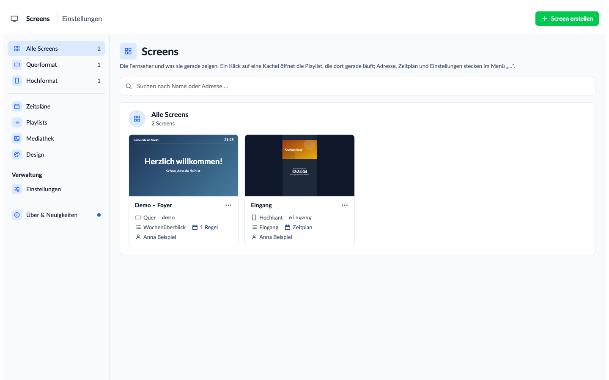
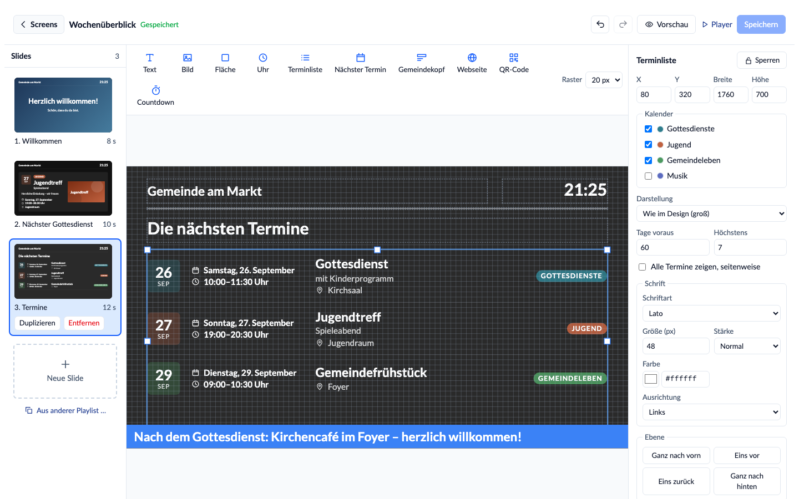
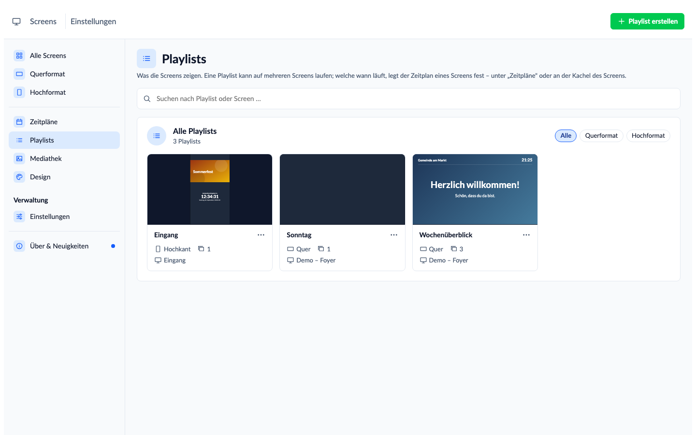
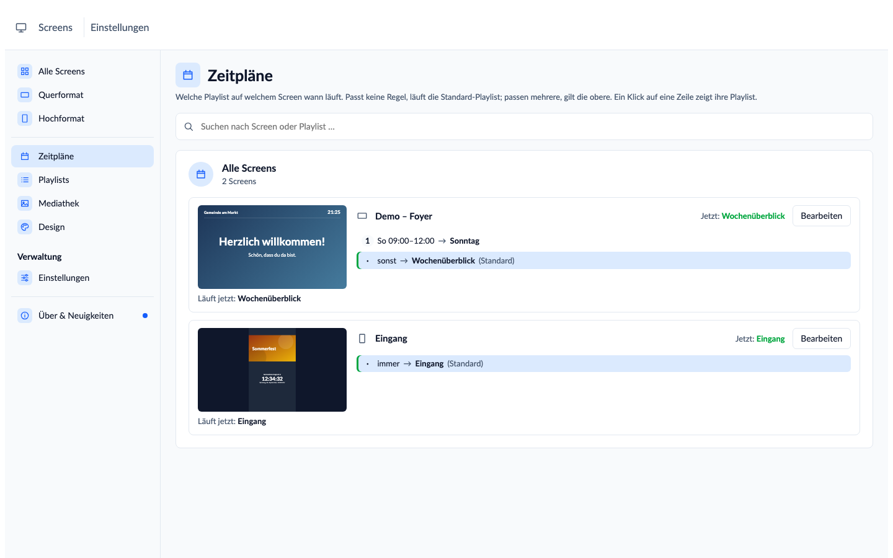
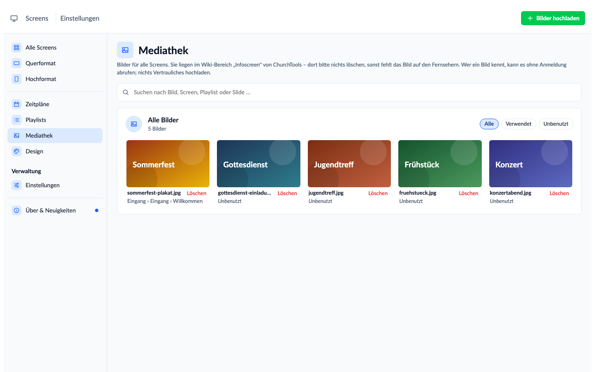
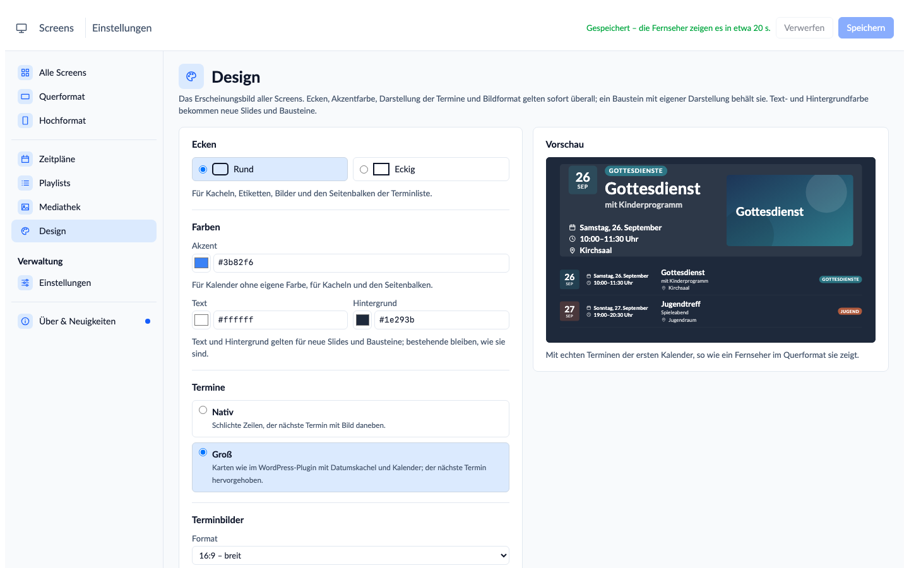

# Onboarding – der Einstieg je Rolle

Wer mit dem Infoscreen Designer arbeitet, hat eine von drei Rollen. Hier steht für jede, was zu tun ist – in der
Reihenfolge, in der es passiert. Die Einzelheiten stehen in der [Einrichtungsanleitung](Einrichtung.md), welche
Rechte wer braucht in der [Rechte-Übersicht](Rechte.md).

| Rolle | Wer | Aufgabe |
| --- | --- | --- |
| [Administrator](#administrator--einmal-einrichten) | ChurchTools-Admin | installiert, vergibt Rechte, legt Screens an |
| [Gestalter](#gestalter--inhalte-gestalten) | Mitglied von „Infoscreen-Designer" | gestaltet, was die Screens zeigen |
| [Gerät](#gerät--der-fernseher) | Konto eines Fernsehers | zeigt einen Screen an – ohne dass jemand etwas tut |

## Administrator – einmal einrichten

Etwa eine halbe Stunde, den Fernseher nicht mitgezählt.

- [ ] **Extension installieren:** das ZIP von der
      [Release-Seite](https://github.com/wirsindcgks/churchtools-infoscreen/releases) in der Extension-Verwaltung von
      ChurchTools hochladen ([Schritt 1](Einrichtung.md#1-extension-installieren)).
- [ ] **Dir selbst die Modulrechte geben** – auch Admins sehen das Modul sonst nicht
      ([Schritt 2](Einrichtung.md#2-dir-selbst-die-modulrechte-geben)).
- [ ] **Designer einmal öffnen** – er legt dabei seine Ablage an.
- [ ] **Einstellungen → „Gruppen und Rechte anlegen"** – der Assistent legt „Infoscreen-Designer" und
      „Infoscreen-Devices" samt Rechten an ([Schritt 4](Einrichtung.md#4-gruppen-und-rechte-anlegen-lassen)).
- [ ] **Screens anlegen:** Startseite → **„+ Screen erstellen"**, je Fernseher einer. Name und Overscan später über
      „…" → „Einstellungen".
- [ ] **Gestalter aufnehmen:** in die Gruppe „Infoscreen-Designer", egal in welcher Rolle.
- [ ] **Je Fernseher ein Geräte-Konto** mit Benutzername und Passwort, Personenstatus mit wenig Rechten, Mitglied
      von „Infoscreen-Devices" ([Schritt 6](Einrichtung.md#6-geräte-benutzer-anlegen)).
- [ ] **Adresse für den Fernseher erzeugen:** Einstellungen → „Adresse für einen Fernseher"
      ([Schritt 7](Einrichtung.md#7-den-fernseher-einrichten)).

**Danach gelegentlich:**

- **Nach jedem Update** und wenn ein Screen einen neuen Kalender zeigt: Einstellungen → **„Rechte aktualisieren"**.
- **Gerät verloren?** Passwort des Geräte-Kontos ändern, neue Adresse erzeugen
  ([Notbremse](Einrichtung.md#wenn-ein-gerät-verloren-geht--die-notbremse)).
- **Jemand hört auf zu gestalten?** Aus der Gruppe „Infoscreen-Designer" nehmen – die Rechte gehen mit.

## Gestalter – Inhalte gestalten

Du brauchst nur die Mitgliedschaft in „Infoscreen-Designer"; alles Weitere kommt von dort. Die Bilder hier zeigen
eine erfundene Gemeinde.

### 1. Die Screens

In ChurchTools oben auf **„Infoscreen Designer"**. Die Startseite zeigt jeden Fernseher als Kachel – mit dem, was er
**gerade** zeigt. Ein Klick auf die Kachel öffnet diese Playlist im Editor; Adresse, Zeitplan und Player stecken im
Menü „…". Neue Screens legt ein Administrator an.

### 2. Slides gestalten

- **Links die Slides** – „Neue Slide" unter der letzten, ziehen zum Umsortieren, darunter **„Aus anderer Playlist
  …"**, um Slides einer anderen Playlist als Kopie zu übernehmen.
- **Oben die Bausteine:** Text, Bild, Fläche, Uhr, Terminliste, Nächster Termin, Gemeindekopf, Webseite, QR-Code und
  **Countdown** („Gottesdienst beginnt in 12:34").
- **In der Mitte die Bühne:** ziehen, an den Griffen skalieren, am Raster ausrichten.
- **Rechts der Inspektor:** Schrift, Farben (auch als Hex-Wert), Kalender, Hintergrund. Oben **„Sperren"**, damit
  ein Logo oder Hintergrund nicht verrutscht – ein Klick darauf erreicht dann den Baustein darunter, mit gedrückter
  Alt-Taste (Mac: Option) den gesperrten selbst.
- **Hinweisband:** Ist kein Baustein gewählt, zeigt der Inspektor die Playlist. Dort lässt sich ein Band über alle
  Slides legen – als Laufschrift oder stehend, etwa „Heute Parkplatz gesperrt", mit **„Zeigen bis"**, danach
  verschwindet es von selbst.
- **Vorschau** (oben): spielt die Playlist mit deinen Änderungen im Vollbild ab, wie der Fernseher – ohne zu
  speichern. Esc schließt sie.
- **Speichern** (oder ⌘S / Strg+S). Alle Fernseher, die diese Playlist zeigen, übernehmen die Änderung in etwa
  20 Sekunden von selbst.

### 3. Playlists

Eine **Playlist** ist der Inhalt, den ein Screen zeigt; sie kann auf mehreren Screens laufen. Unter **„Playlists"**
legst du neue an (oben rechts) und **duplizierst** bestehende (Menü „…") – die Kopie hat eigene Slides, Änderungen
daran berühren das Original nicht.

### 4. Zeitpläne

Welche Playlist ein Screen wann zeigt. Die **Standard-Playlist** läuft, wenn keine **Regel** passt. Regeln schalten auf
eine andere – nach Uhrzeit („sonntags 9–12 Uhr") oder rund um Termine („30 Minuten vor Beginn bis 10 Minuten nach
Beginn" für eine Begrüßung); passen mehrere, gewinnt die obere. Die Seite **„Zeitpläne"** zeigt alle Screens mit
ihren Regeln und daneben die Playlist, die gerade läuft; ein Klick auf eine Regel zeigt deren Playlist.
„Bearbeiten" öffnet denselben Dialog wie „Zeitplan" an der Kachel.

### 5. Bilder

Über den Baustein „Bild" oder in der **Mediathek**. Unter jedem Bild steht, wo es läuft („Foyer › Gottesdienst ›
Begrüßung"); „Unbenutzt" hilft beim Aufräumen. Ein Bild lässt sich beliebig oft verwenden. **Nichts Vertrauliches
hochladen** – Bilder sind über ihre Adresse ohne Anmeldung abrufbar.

### 6. Design

Einmal für alle Screens: Ecken rund oder eckig, Akzentfarbe, Farben für neue Slides, Termine **„Nativ"** (schlichte
Zeilen) oder **„Modern"** (Karten mit Datumskachel) und das Format der Terminbilder – mit Vorschau. Ein Baustein, der
eine eigene Darstellung gewählt hat, behält sie.

### Gut zu wissen

- **Rückgängig** mit ⌘Z / Strg+Z; ein Ziehen ist ein Schritt.
- **Speichert jemand anderes gleichzeitig dieselbe Playlist**, fragt der Editor, welche Fassung gelten soll.
- **Neuer Kalender auf einem Screen** – in einer Terminliste, einem Countdown oder einer Termin-Regel? Dann einem
  Administrator Bescheid geben: Er klickt einmal „Rechte aktualisieren", damit die Fernseher den Kalender lesen
  dürfen.
- **Sagt die Startseite „Dir fehlen Rechte"**, nennt sie das Recht – gib die Meldung an einen Administrator weiter.
- **Was neu ist**, steht unter **„Über & Neuigkeiten"** unten in der Seitenleiste; ein blauer Punkt zeigt eine neue
  Version an.
- **Alles auf einem Screen sieht jeder im Foyer.** Personenbezogenes gehört nicht darauf.

## Gerät – der Fernseher

Das Gerät tut nichts selbst; es braucht nur einmal die richtige Adresse.

- [ ] Ein Administrator hat ein **Geräte-Konto** angelegt und in den **Einstellungen die Adresse** erzeugt.
- [ ] Die Adresse ist die **Startseite des Kiosk-Browsers**, im Vollbild; auf einem Raspberry Pi mit FullPageOS in
      `fullpageos.txt`. Tastatur und Maus braucht es nicht.
- [ ] **Bildschirmschoner und Energiesparen aus.**

Danach meldet sich der Fernseher bei jedem Start selbst an, holt Änderungen in etwa 20 Sekunden, zeigt bei Netzausfall
den letzten Stand und lädt jede Nacht neu. Zeigt er „nicht angemeldet", eine neue Adresse erzeugen – meist wurde das
Passwort des Geräte-Kontos geändert.
